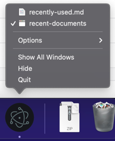

# Recent Documents (Windows & macOS)

## Overview

Windows and macOS provide access to a list of recent documents opened by
the application via JumpList or dock menu, respectively.

__JumpList:__

![JumpList Recent Files][jumplist-image]

__Application dock menu:__

![macOS Dock Menu][dock-menu-image]

## Example

### Managing recent documents

```fiddle docs/latest/fiddles/features/recent-documents
const { app, BrowserWindow } = require('electron')
const fs = require('fs')
const path = require('path')

const createWindow = () => {
  const win = new BrowserWindow({
    width: 800,
    height: 600
  })

  win.loadFile('index.html')
}

const fileName = 'recently-used.md'
fs.writeFile(fileName, 'Lorem Ipsum', () => {
  app.addRecentDocument(path.join(__dirname, fileName))
})

app.whenReady().then(createWindow)

app.on('window-all-closed', () => {
  app.clearRecentDocuments()
  if (process.platform !== 'darwin') {
    app.quit()
  }
})

app.on('activate', () => {
  if (BrowserWindow.getAllWindows().length === 0) {
    createWindow()
  }
})
```

#### Adding a recent document

To add a file to recent documents, use the
[app.addRecentDocument][addrecentdocument] API.

After launching the Electron application, right click the application icon.
In this guide, the item is a Markdown file located in the root of the project.
You should see `recently-used.md` added to the list of recent files:



#### Clearing the list of recent documents

To clear the list of recent documents, use the
[app.clearRecentDocuments][clearrecentdocuments] API.
In this guide, the list of documents is cleared once all windows have been
closed.

## Additional information

### Windows Notes

To use this feature on Windows, your application has to be registered as
a handler of the file type of the document, otherwise the file won't appear
in JumpList even after you have added it. You can find everything
on registering your application in [Application Registration][app-registration].

When a user clicks a file from the JumpList, a new instance of your application
will be started with the path of the file added as a command line argument.

### macOS Notes

#### Add the Recent Documents list to the application menu

You can add menu items to access and clear recent documents by adding the
following code snippet to your menu template:

```json
{
  "submenu":[
    {
      "label":"Open Recent",
      "role":"recentdocuments",
      "submenu":[
        {
          "label":"Clear Recent",
          "role":"clearrecentdocuments"
        }
      ]
    }
  ]
}
```

Make sure the application menu is added after the [`'ready'`](latest/api/app.md#event-ready)
event and not before, or the menu item will be disabled:

```javascript
const { app, Menu } = require('electron')

const template = [
  // Menu template here
]
const menu = Menu.buildFromTemplate(template)

app.whenReady().then(() => {
  Menu.setApplicationMenu(menu)
})
```

![macOS Recent Documents menu item][menu-item-image]

When a file is requested from the recent documents menu, the `open-file` event
of `app` module will be emitted for it.

[jumplist-image]: https://cloud.githubusercontent.com/assets/2289/23446924/11a27b98-fdfc-11e6-8485-cc3b1e86b80a.png
[dock-menu-image]: https://cloud.githubusercontent.com/assets/639601/5069610/2aa80758-6e97-11e4-8cfb-c1a414a10774.png
[addrecentdocument]: latest/api/app.md#appaddrecentdocumentpath-macos-windows
[clearrecentdocuments]: latest/api/app.md#appclearrecentdocuments-macos-windows
[app-registration]: https://msdn.microsoft.com/en-us/library/cc144104(VS.85).aspx
[menu-item-image]: https://user-images.githubusercontent.com/3168941/33003655-ea601c3a-cd70-11e7-97fa-7c062149cfb1.png
